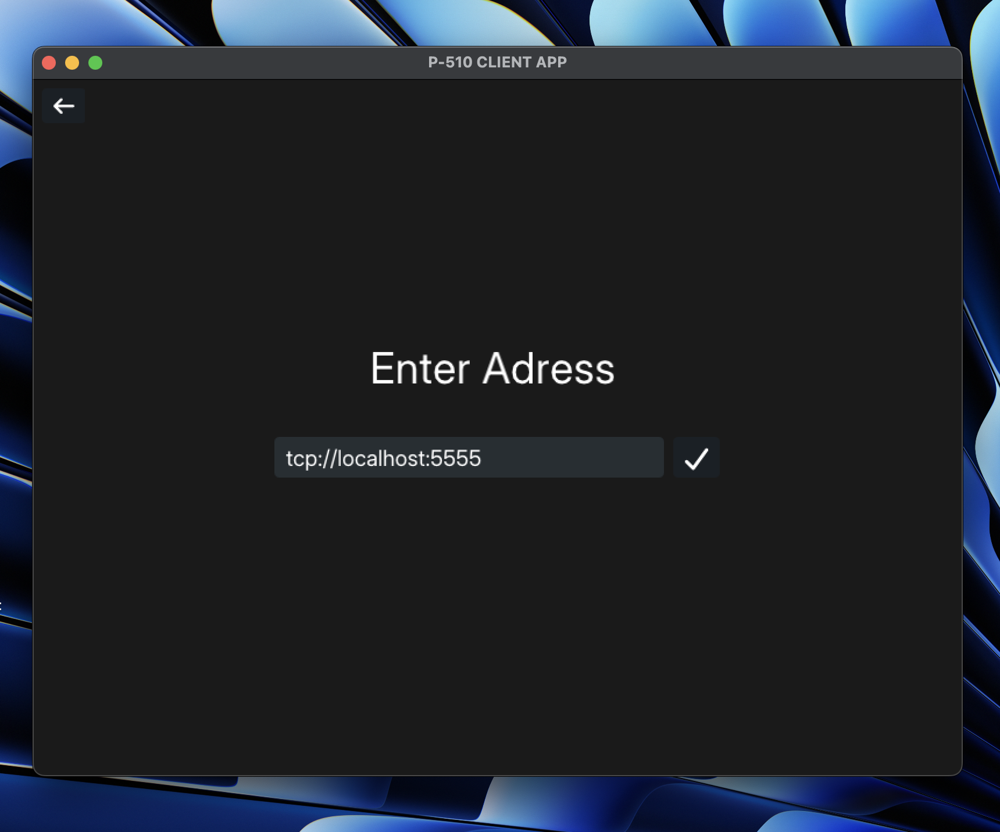
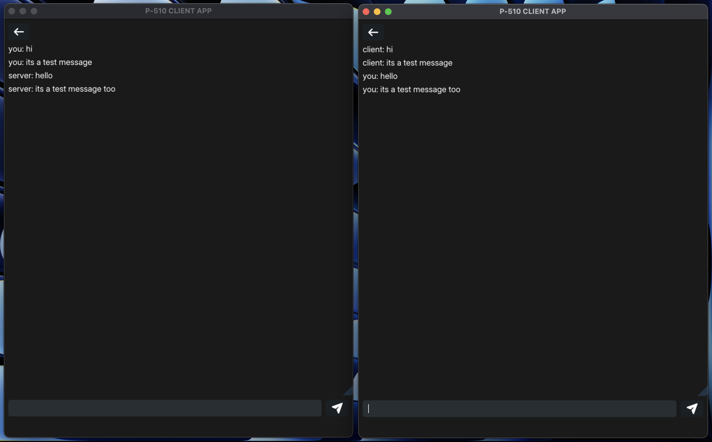

This project is a messaging system built using C++ and ZeroMQ.  
The main purpose is to improve my skills in multithreading, socket communication, and synchronization.

Bu proje, C++ ve ZeroMQ kullanılarak geliştirilmiş bir mesajlaşma sistemidir.  
Amacı, çoklu iş parçacığı, soket haberleşmesi ve senkronizasyon konularında becerilerimi geliştirmektir.

---

## Project Status / Proje Durumu

This project is still under development and may contain bugs or incomplete features.  
Please note that this codebase is intended for educational and experimental purposes only.  
Client-server message communication via ZeroMQ sockets works fine. You can compile and run both.

This messaging system is configured to run over `localhost` by default (for now).  
To run the client and server across different machines or networks:

- Replace `localhost` with the appropriate IP address in both client and server code  
- Ensure firewalls or network configurations allow the chosen port to be accessible  
- Configure port forwarding or use a VPN/tunneling solution depending on your environment

---

Proje hâlâ geliştirme aşamasındadır ve bazı hatalar veya tamamlanmamış özellikler içerebilir.  
Bu kod tabanı yalnızca eğitim ve deneysel amaçlarla hazırlanmıştır.  
ZeroMQ soketleri üzerinden istemci-sunucu mesaj iletişimi düzgün şekilde çalışmaktadır.  
İstemci ve sunucu taraflarını derleyip çalıştırabilirsiniz.

Varsayılan olarak bu mesajlaşma sistemi `localhost` üzerinden çalışacak şekilde yapılandırılmıştır.  
İstemci ve sunucuyu farklı cihazlarda çalıştırmak için:

- Kodlarda geçen `localhost` ifadesini uygun IP adresi ile değiştirin  
- Seçilen portun güvenlik duvarı ya da ağ ayarları tarafından engellenmediğinden emin olun  
- Gerekiyorsa port yönlendirme, VPN veya tünelleme yapılandırması yapın

---

## What's New / Yenilikler

- Graphical User Interface (GUI) added using Dear ImGui with SDL2 and OpenGL2  
- Message history is displayed in real-time using scrollable windows  
- Input/output is fully GUI-driven, terminal interaction not required anymore
- Background threads handle all socket communication independently  
- OpenGL2 backend ensures compatibility on macOS and legacy systems  
- Both client and server now support GUI versions with identical logic to terminal version
- Server address entry screen added. You can now manually enter the server address you want to connect to

---

- Dear ImGui kütüphanesi kullanılarak grafiksel kullanıcı arayüzü (GUI) eklendi  
- Mesaj geçmişi anlık olarak kaydırılabilir pencereler içinde gösteriliyor  
- Girdi/çıktı tamamen GUI üzerinden sağlanıyor, artık terminal kullanımı gerekmiyor  
- Tüm soket haberleşmesi arka planda ayrı iş parçacıklarıyla gerçekleştiriliyor  
- Uyumluluk amacıyla OpenGL2 backend kullanıldı (özellikle macOS için)  
- Hem istemci hem sunucu tarafı, terminal sürümü ile aynı mantıkta GUI sürümleriyle destekleniyor
- Sunucu adresi giriş ekranı eklendi. Artık bağlanmak istediğiniz server adresini manuel olarak girebilirsiniz

---

## Requirements / Gereksinimler

- A C++17 compatible compiler  
- ZeroMQ library (`libzmq`) and C++ bindings (`cppzmq`)  
- SDL2 development libraries  
- OpenGL2 support   
- Dear ImGui source files (https://github.com/ocornut/imgui)

---

- C++17 uyumlu bir derleyici  
- ZeroMQ (`libzmq`) ve C++ bağlayıcısı (`cppzmq`)  
- SDL2 geliştirme kütüphaneleri  
- OpenGL2 desteği 
- Dear ImGui kaynak dosyaları (https://github.com/ocornut/imgui)

---

## License / Lisans

This project is created for educational purposes and has no commercial intent.
You are free to use, modify, and share it.

Bu proje yalnızca eğitim amaçlı geliştirilmiştir ve ticari bir amacı yoktur.
Dilediğiniz gibi kullanabilir, değiştirebilir ve paylaşabilirsiniz.
