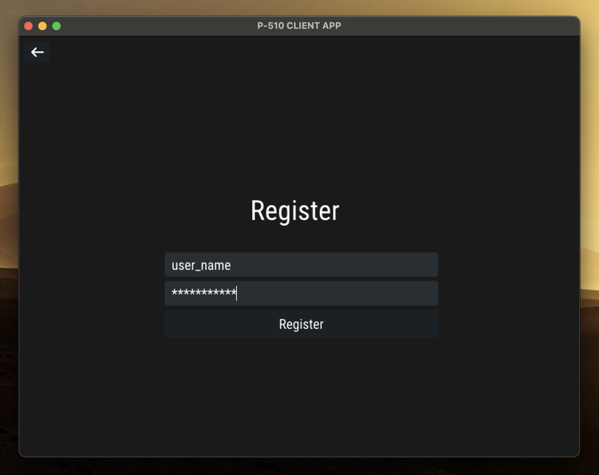
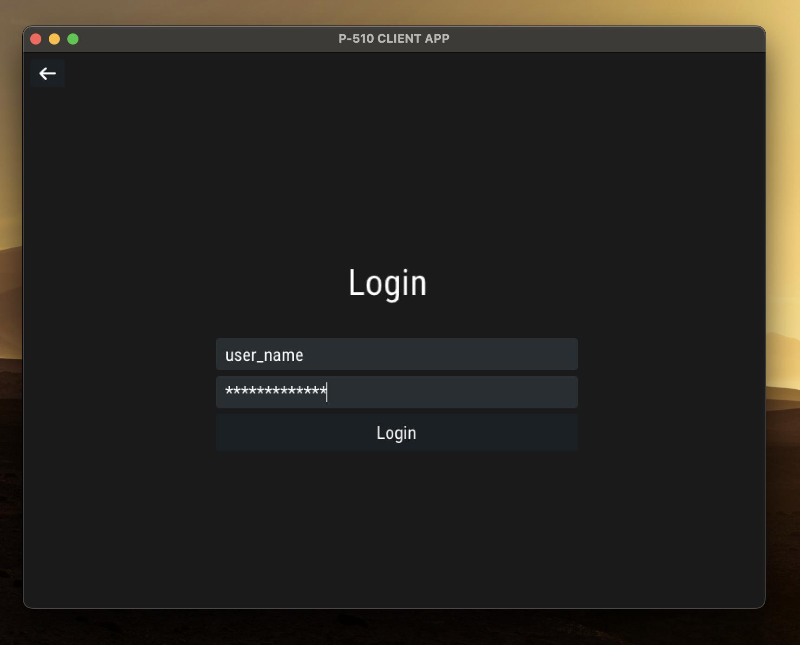
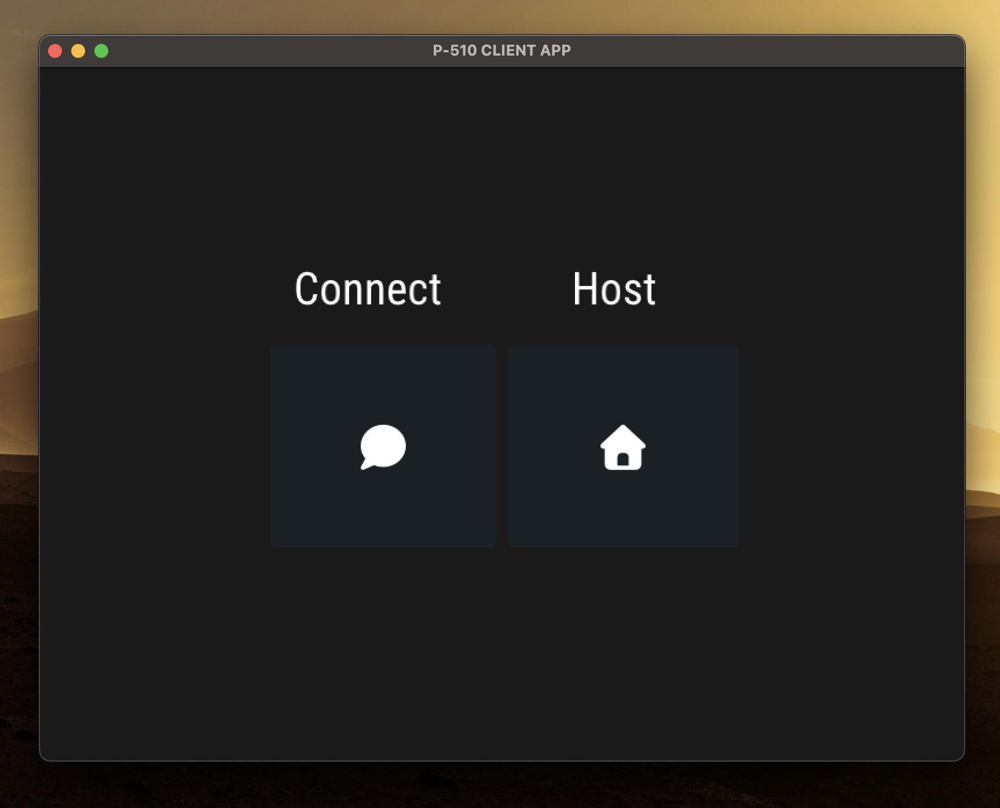
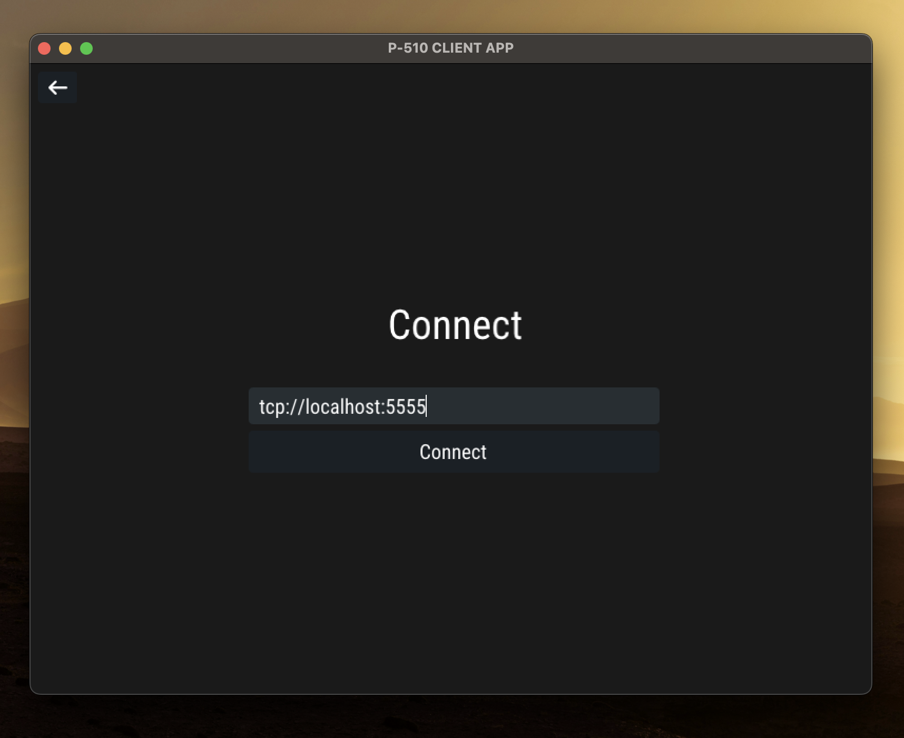
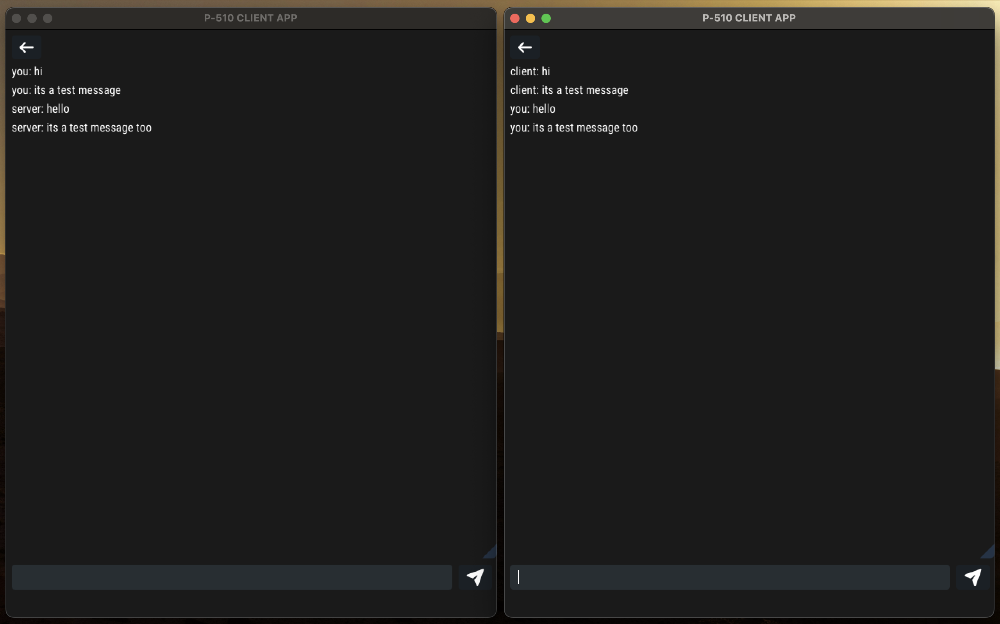

This project is a messaging system built using C++ and ZeroMQ.  
The main purpose is to improve my skills in multithreading and socket programming.

---

## Project Status

This project is still under development and may contain bugs or incomplete features.  
Please note that this codebase is intended for educational and experimental purposes only.  
Client-server message communication via ZeroMQ sockets works fine. You can compile and run.

I'm planning to add these features in the future:

- User authentication system (register/login)
- Local user database
- Secure password hashing
- Session-based user management
- Protection against duplicate usernames

To run the client and server across different machines or networks:

- You must enter the appropriate IP address in client mode.
- You don't need to do anything for the server side.
- Ensure firewalls or network configurations allow the chosen port to be accessible.
- Configure port forwarding or use a VPN/tunneling solution depending on your environment.

---

## What's New

- Graphical User Interface (GUI) added using Dear ImGui with SDL2 and OpenGL2  
- Message history is displayed in windows  
- Input/output is fully GUI-driven, terminal interaction not required anymore
- Background threads handle all socket communication independently  
- OpenGL2 backend ensures compatibility on macOS and legacy systems  
- Server address entry screen added. You can now manually enter the server address you want to connect to

---

## Requirements 

- A C++17 compatible compiler  
- ZeroMQ library (`libzmq`) and C++ bindings (`cppzmq`)  
- SDL2 development libraries  
- OpenGL2 support   
- Dear ImGui source files (https://github.com/ocornut/imgui)

---

## License / Lisans

This project is created for educational purposes and has no commercial intent.
You are free to use, modify, and share it. 
This application uses icons from Font Awesome Free — https://fontawesome.com

